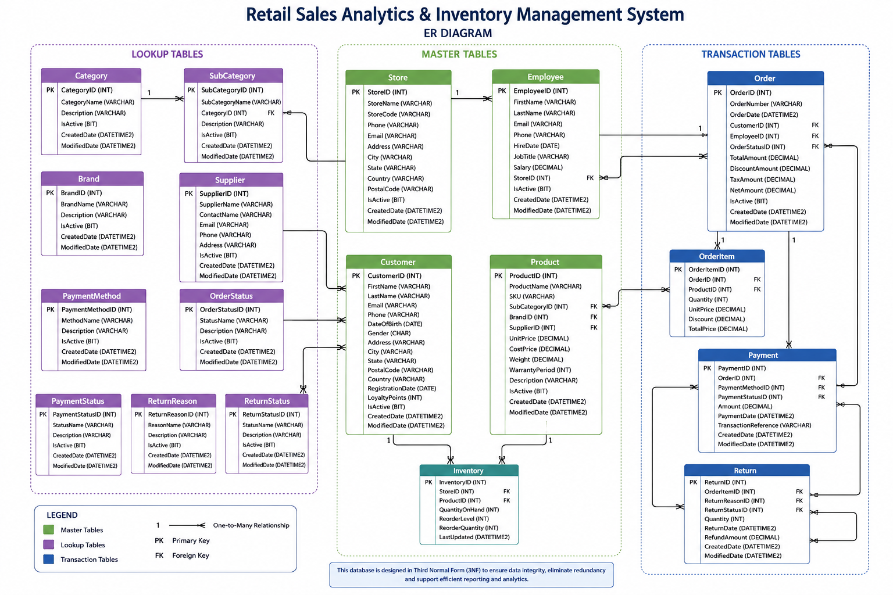

# 🛒 Retail Sales Analytics & Inventory Management System

A production-inspired **Microsoft SQL Server** project that simulates the operations of a modern retail business. This project demonstrates end-to-end database design, data modeling, normalization, SQL development, data generation, performance optimization, and business analytics.

Designed as a portfolio project for **Data Analyst**, **SQL Developer**, and **Business Intelligence** roles, it showcases industry-standard database development practices and serves as the foundation for interactive Power BI dashboards.

---

## Project Information

| Property | Value |
|----------|-------|
| **Project** | Retail Sales Analytics & Inventory Management System |
| **Database** | RetailSalesDB |
| **Database Platform** | Microsoft SQL Server |
| **Query Language** | T-SQL |
| **Project Type** | End-to-End SQL Portfolio Project |
| **Architecture** | Relational Database (3NF) |
| **Reporting Tool** | Microsoft Power BI *(Planned)* |
| **Author** | Akshay Aswani |
| **Status** | 🚧 In Development |

---

## Key Highlights

- Production-inspired retail database
- Third Normal Form (3NF) database design
- Lookup, Master, and Transaction tables
- Primary & Foreign Key relationships
- CHECK, DEFAULT, and UNIQUE constraints
- Clustered & Non-Clustered Indexes
- Enterprise-style SQL documentation
- Realistic business data generation
- Advanced SQL analytics
- Power BI ready database
- Git & GitHub version control

---

## Table of Contents

1. [Project Overview](#1-project-overview)
2. [Business Problem](#2-business-problem)
3. [Project Objectives](#3-project-objectives)
4. [Project Scope](#4-project-scope)
5. [Technology Stack](#5-technology-stack)
6. [Database Overview](#6-database-overview)
7. [Database Statistics](#7-database-statistics)
8. [Database Architecture](#8-database-architecture)
9. [Entity Relationship Diagram](#9-entity-relationship-diagram)
10. [Project Structure](#10-project-structure)
11. [SQL Features Implemented](#11-sql-features-implemented)
12. [Documentation](#12-documentation)
13. [Project Workflow](#13-project-workflow)
14. [Power BI Dashboard](#14-power-bi-dashboard)
15. [Setup Instructions](#15-setup-instructions)
16. [Project Status](#16-project-status)
17. [Learning Outcomes](#17-learning-outcomes)
18. [Future Enhancements](#18-future-enhancements)
19. [License](#19-license)
20. [Author](#20-author)

---

# 1. Project Overview

Retail organizations generate large volumes of transactional data every day across products, stores, customers, employees, suppliers, payments, and inventory. Managing this information efficiently requires a well-designed relational database that supports both operational processes and analytical reporting.

The **Retail Sales Analytics & Inventory Management System** is an end-to-end SQL Server database project that simulates a real-world retail environment. The project has been designed following Microsoft SQL Server best practices and demonstrates the complete lifecycle of relational database development—from database design and normalization to data generation, performance optimization, SQL analysis, and business intelligence reporting.

This project serves as a comprehensive portfolio showcasing practical SQL development skills, data modeling techniques, and documentation standards commonly used in enterprise environments.

---

## Project Goals

The primary goals of this project are to:

- Design a scalable relational database
- Apply Third Normal Form (3NF) normalization
- Implement robust data integrity using constraints
- Generate realistic business data
- Perform advanced SQL analysis
- Build business-ready reporting datasets
- Develop interactive Power BI dashboards
- Demonstrate enterprise SQL Server development practices

---

## Intended Audience

This repository is intended for:

- Recruiters reviewing SQL portfolios
- Hiring Managers
- Data Analysts
- SQL Developers
- Database Developers
- Business Intelligence Professionals
- Students learning SQL Server
- Anyone interested in relational database design

---

## Why This Project?

Unlike small SQL practice databases, this project follows a production-inspired approach by combining:

- Professional database design
- Enterprise documentation
- Realistic business scenarios
- Scalable architecture
- SQL Server best practices
- Analytics-ready schema

The result is a complete portfolio project that demonstrates both technical implementation and documentation skills expected in professional data-focused roles.

---

# 2. Business Problem

Modern retail businesses generate thousands of transactions every day across multiple stores, products, customers, suppliers, and payment channels. Managing this operational data efficiently requires a well-designed relational database that ensures data consistency, supports business operations, and enables analytical reporting.

Without a structured database, organizations often face challenges such as:

- Duplicate and inconsistent data
- Poor inventory visibility
- Difficulty tracking customer purchasing behavior
- Inefficient sales reporting
- Limited business insights
- Slow query performance
- Poor scalability as the business grows

To address these challenges, businesses rely on normalized relational databases that maintain data integrity while supporting both transactional processing (OLTP) and business intelligence reporting.

This project simulates a real-world retail database by implementing industry-standard database design principles and SQL Server best practices.

---

# 3. Project Objectives

The primary objective of this project is to design and implement a scalable, production-inspired retail database using Microsoft SQL Server.

The project aims to demonstrate practical database development skills that are commonly required for Data Analyst, SQL Developer, and Business Intelligence roles.

## Objectives

- Design a normalized relational database (3NF)
- Implement Primary Key and Foreign Key relationships
- Enforce business rules using SQL constraints
- Generate realistic retail business data
- Optimize query performance using indexes
- Build reusable SQL objects such as Views, Stored Procedures, Functions, and Triggers
- Perform business analysis using advanced SQL queries
- Create datasets optimized for Power BI reporting
- Follow enterprise SQL Server development standards
- Maintain comprehensive project documentation

---

# 4. Project Scope

The Retail Sales Analytics & Inventory Management System covers the core business operations of a retail organization.

## Included Modules

### Product Management

- Category Management
- SubCategory Management
- Brand Management
- Supplier Management
- Product Catalog

---

### Store Management

- Store Information
- Employee Management

---

### Customer Management

- Customer Registration
- Customer Information

---

### Inventory Management

- Product Inventory
- Stock Availability
- Inventory Tracking

---

### Sales Management

- Customer Orders
- Order Items
- Sales Transactions

---

### Payment Management

- Payment Processing
- Payment Methods
- Payment Status Tracking

---

### Return Management

- Product Returns
- Return Reasons
- Return Status Tracking
- Refund Information

---

### Business Analytics

- Sales Analysis
- Customer Analysis
- Product Performance
- Inventory Analysis
- Supplier Performance
- Store Performance
- Return Analysis

---

## Out of Scope

The following features are intentionally excluded from the current version of the project:

- Online shopping cart
- User authentication
- Product reviews and ratings
- Shipment and logistics tracking
- Multi-currency support
- Multi-language support
- Tax calculation engine
- Discount and coupon engine
- Mobile application
- Web application

These features may be included in future project versions.

---

# 5. Technology Stack

The project is developed using Microsoft technologies and follows SQL Server best practices.

| Category | Technology |
|----------|------------|
| Database Platform | Microsoft SQL Server |
| Query Language | T-SQL |
| Database IDE | SQL Server Management Studio (SSMS) |
| Data Modeling | Relational Database Design |
| Documentation | Markdown |
| Version Control | Git |
| Repository Hosting | GitHub |
| ER Diagram | Draw.io |
| Reporting & Visualization | Microsoft Power BI *(Planned)* |

---

## SQL Server Features Used

The project demonstrates a wide range of SQL Server capabilities, including:

### Database Design

- Database Creation
- Table Design
- Data Modeling
- Normalization (3NF)

---

### Constraints

- Primary Keys
- Foreign Keys
- CHECK Constraints
- DEFAULT Constraints
- UNIQUE Constraints

---

### Performance

- Clustered Indexes
- Non-Clustered Indexes
- Query Optimization
- Indexing Strategy

---

### Programmability *(Upcoming)*

- Views
- Stored Procedures
- User Defined Functions (UDFs)
- Triggers
- Transactions

---

### SQL Analytics *(Upcoming)*

- JOIN Operations
- Common Table Expressions (CTEs)
- Window Functions
- Ranking Functions
- Aggregate Functions
- PIVOT / UNPIVOT
- Subqueries
- Business Reporting Queries

---

## Development Workflow

The project follows a structured development lifecycle to ensure consistency, maintainability, and scalability.

```text
Business Requirements
          │
          ▼
Database Design
          │
          ▼
Table Creation
          │
          ▼
Constraints
          │
          ▼
Indexes
          │
          ▼
Master Data
          │
          ▼
Transaction Data
          │
          ▼
SQL Analysis
          │
          ▼
Power BI Dashboard
          │
          ▼
Documentation
```

This workflow reflects the order in which the project is being developed and aligns with common database development practices.

---

# 6. Database Overview

The **RetailSalesDB** is a production-inspired relational database designed to simulate the day-to-day operations of a retail organization.

The database supports multiple business domains, including product management, inventory tracking, customer management, sales processing, payment management, and product returns.

It has been designed following Microsoft SQL Server best practices to ensure scalability, maintainability, and high-performance querying.

---

## Database Design Principles

The database was developed using the following design principles:

- Third Normal Form (3NF)
- Surrogate Primary Keys (`INT IDENTITY`)
- Referential Integrity
- Lookup Table Design
- Modular Architecture
- Enterprise Naming Conventions
- Optimized Indexing Strategy
- Audit Columns for Data Tracking
- Scalable Schema Design

---

## Database Modules

The database is organized into logical business modules.

| Module | Description |
|----------|-------------|
| Product Management | Categories, SubCategories, Brands, Suppliers and Products |
| Store Management | Stores and Employees |
| Customer Management | Customer Information |
| Inventory Management | Product Stock Tracking |
| Sales Management | Orders and Order Items |
| Payment Management | Payment Processing |
| Return Management | Product Returns and Refund Tracking |
| Business Analytics | Reporting and Power BI |

---

# 7. Database Statistics

The current database consists of **18 relational tables** organized into three logical categories.

| Database Object | Count |
|-----------------|------:|
| Total Tables | 18 |
| Lookup Tables | 9 |
| Master Tables | 4 |
| Transaction Tables | 5 |
| Primary Keys | 18 |
| Foreign Keys | 18 |
| CHECK Constraints | Multiple |
| DEFAULT Constraints | Multiple |
| UNIQUE Constraints | Multiple |
| Clustered Indexes | 18 |
| Non-Clustered Indexes | Multiple |

---

## Table Classification

### Lookup Tables

These tables store reusable reference data used throughout the system.

- Category
- SubCategory
- Brand
- Supplier
- PaymentMethod
- OrderStatus
- PaymentStatus
- ReturnReason
- ReturnStatus

---

### Master Tables

These tables represent the primary business entities.

- Product
- Store
- Employee
- Customer

---

### Transaction Tables

These tables record day-to-day business operations.

- Inventory
- Order
- OrderItem
- Payment
- Return

---

# 8. Database Architecture

The RetailSalesDB follows a layered relational architecture that separates reusable reference data, business entities, and transactional records.

```text
                    Lookup Tables
                          │
        ┌─────────────────┼──────────────────┐
        ▼                 ▼                  ▼
   Category            Brand            Supplier
        │
        ▼
  SubCategory
        │
        ▼

                 Master Tables

        Product      Store      Employee     Customer
            │            │
            │            ▼
            │       Inventory
            │
            ▼

              Transaction Tables

Order ─────────► OrderItem ─────────► Return
  │
  ▼
Payment
```

---

## Architecture Benefits

- Clear separation of responsibilities
- Reduced data redundancy
- Improved maintainability
- Better query performance
- Easier scalability
- Enterprise-ready structure
- Optimized for Power BI reporting

---

# 9. Entity Relationship Diagram

The Entity Relationship Diagram (ERD) provides a visual representation of the database structure, including all tables, primary keys, foreign keys, and relationships.

It serves as the blueprint for the database and helps developers understand how business entities are connected.

---

<p align="center">



</p>

---

## Relationship Summary

The database contains **18 One-to-Many relationships**, ensuring strong referential integrity throughout the system.

| Parent Table | Child Table |
|--------------|-------------|
| Category | SubCategory |
| SubCategory | Product |
| Brand | Product |
| Supplier | Product |
| Store | Employee |
| Store | Inventory |
| Product | Inventory |
| Customer | Order |
| Employee | Order |
| OrderStatus | Order |
| Order | OrderItem |
| Product | OrderItem |
| Order | Payment |
| PaymentMethod | Payment |
| PaymentStatus | Payment |
| OrderItem | Return |
| ReturnReason | Return |
| ReturnStatus | Return |

---

## Database Design Highlights

The RetailSalesDB has been designed using modern relational database principles.

### Key Highlights

- Fully Normalized (Third Normal Form - 3NF)
- Enterprise Naming Conventions
- Surrogate Primary Keys
- Referential Integrity using Foreign Keys
- Business Rules enforced using CHECK Constraints
- Automatic auditing with `CreatedDate` and `ModifiedDate`
- Optimized Indexing Strategy
- Modular and Scalable Design
- Power BI Ready Database
- Enterprise Documentation

---

## Documentation

Comprehensive documentation has been created for every stage of the project.

| Document | Description |
|----------|-------------|
| Business Requirements | Project objectives and business requirements |
| Project Architecture | Overall system architecture |
| Naming Conventions | SQL naming standards |
| Data Dictionary | Complete table and column reference |
| Database Design Decisions | Design rationale and implementation choices |
| Entity Relationship Diagram | Visual database model |

These documents provide complete technical documentation for understanding, maintaining, and extending the database.

---

# 10. Project Structure

The repository is organized into logical folders to separate database scripts, data generation, documentation, analytics, and reporting components.

```text
Retail-Sales-Analytics-Inventory-Management-System/
│
├── README.md
├── LICENSE
├── .gitignore
│
├── 01_Database/
│   ├── 01_Create_Database.sql
│   ├── 02_Create_Tables.sql
│   ├── 03_Create_Constraints.sql
│   └── 04_Create_Indexes.sql
│
├── 02_Master_Data/
│   ├── 05_Generate_Lookup_Data.sql
│   └── 06_Generate_Master_Data.sql
│
├── 03_Transaction_Data/
│   ├── 07_Generate_Orders.sql
│   ├── 08_Generate_OrderItems.sql
│   ├── 09_Generate_Payments.sql
│   ├── 10_Generate_Inventory.sql
│   └── 11_Generate_Returns.sql
│
├── 04_Views/
├── 05_Stored_Procedures/
├── 06_Functions/
├── 07_Triggers/
├── 08_SQL_Analysis/
├── 09_Performance_Tuning/
├── 10_PowerBI/
│
├── 11_Documentation/
│   ├── Images/
│   │   └── ER_Diagram.png
│   │
│   ├── 01_Business_Requirements.md
│   ├── 02_Project_Architecture.md
│   ├── 03_Naming_Conventions.md
│   ├── 04_Data_Dictionary.md
│   ├── 05_Database_Design_Decisions.md
│   └── 06_ER_Diagram.md
│
└── Dataset/
```

---

## Repository Organization

| Folder | Purpose |
|----------|---------|
| **01_Database** | Database creation, tables, constraints, and indexes |
| **02_Master_Data** | Lookup and master data generation |
| **03_Transaction_Data** | Transactional data generation scripts |
| **04_Views** | Reporting and analytical views |
| **05_Stored_Procedures** | Business logic using stored procedures |
| **06_Functions** | User-defined functions |
| **07_Triggers** | Database triggers |
| **08_SQL_Analysis** | Business and analytical SQL queries |
| **09_Performance_Tuning** | Query optimization and indexing |
| **10_PowerBI** | Power BI reports and dashboards |
| **11_Documentation** | Complete technical documentation |
| **Dataset** | Sample datasets and exported files |

---

# 11. SQL Features Implemented

The project demonstrates a broad range of SQL Server concepts commonly used in enterprise database development.

## Database Design

- Database Creation
- Relational Database Modeling
- Third Normal Form (3NF)
- Entity Relationship Design
- Surrogate Primary Keys
- Foreign Key Relationships

---

## Constraints

- Primary Keys
- Foreign Keys
- CHECK Constraints
- DEFAULT Constraints
- UNIQUE Constraints
- NOT NULL Constraints

---

## Indexing

- Clustered Indexes
- Non-Clustered Indexes
- Optimized Search Columns
- Performance-Oriented Index Design

---

## Data Generation

- Lookup Data
- Master Data
- Transaction Data
- Realistic Business Scenarios
- Large Volume Test Data

---

## SQL Programming *(Upcoming)*

- Views
- Stored Procedures
- User Defined Functions
- Triggers
- Transactions
- Error Handling

---

## SQL Analytics *(Upcoming)*

- JOIN Operations
- Aggregate Functions
- Window Functions
- Common Table Expressions (CTEs)
- Ranking Functions
- PIVOT / UNPIVOT
- Subqueries
- Case Expressions
- Business KPI Queries

---

# 12. Documentation

Comprehensive documentation has been created to explain every aspect of the project.

| Document | Purpose |
|----------|---------|
| **01_Business_Requirements.md** | Business objectives and project scope |
| **02_Project_Architecture.md** | Overall database architecture |
| **03_Naming_Conventions.md** | SQL naming standards |
| **04_Data_Dictionary.md** | Detailed table and column definitions |
| **05_Database_Design_Decisions.md** | Database design rationale |
| **06_ER_Diagram.md** | Entity Relationship Diagram documentation |

---

## Documentation Highlights

The documentation covers:

- Business requirements
- Database architecture
- Naming standards
- Data dictionary
- Database design decisions
- Entity relationship diagram
- SQL development standards
- Best practices

Together, these documents provide a complete technical reference for understanding, maintaining, and extending the database.

---

# 13. Project Workflow

The project follows a structured database development lifecycle.

```text
Business Requirements
          │
          ▼
Database Design
          │
          ▼
ER Diagram
          │
          ▼
Database Creation
          │
          ▼
Table Creation
          │
          ▼
Constraints
          │
          ▼
Indexes
          │
          ▼
Lookup Data
          │
          ▼
Master Data
          │
          ▼
Transaction Data
          │
          ▼
Views
          │
          ▼
Stored Procedures
          │
          ▼
Functions
          │
          ▼
Triggers
          │
          ▼
SQL Analysis
          │
          ▼
Performance Tuning
          │
          ▼
Power BI Dashboard
```

---

## Development Methodology

The project has been developed incrementally using Git and GitHub.

Each major milestone is committed separately, including:

- Database creation
- Table creation
- Constraints
- Indexes
- Data generation
- Documentation
- SQL analysis
- Performance optimization

This approach provides a clear development history and demonstrates professional version control practices.

---

# 14. Power BI Dashboard *(Coming Soon)*

The RetailSalesDB has been designed as the data source for interactive Power BI dashboards.

The upcoming dashboards will provide actionable business insights across sales, inventory, customers, products, stores, suppliers, and returns.

---

## Planned Dashboards

### Executive Dashboard

- Revenue Overview
- Total Orders
- Profit Analysis
- Sales Trends
- KPI Summary

---

### Sales Dashboard

- Daily Sales
- Monthly Sales
- Year-over-Year Growth
- Top Selling Products
- Sales by Category
- Sales by Store

---

### Customer Dashboard

- Customer Segmentation
- Repeat Customers
- Customer Lifetime Value
- Top Customers
- Geographic Distribution

---

### Product Dashboard

- Product Performance
- Category Performance
- Brand Performance
- Slow Moving Products
- Fast Moving Products

---

### Inventory Dashboard

- Current Stock Levels
- Low Stock Alerts
- Inventory Turnover
- Stock Valuation

---

### Returns Dashboard

- Return Rate
- Return Reasons
- Return Trends
- Returned Products Analysis

---

# 15. Setup Instructions

Follow these steps to run the project locally.

## Prerequisites

- Microsoft SQL Server
- SQL Server Management Studio (SSMS)
- Git
- GitHub
- Microsoft Power BI Desktop *(Optional)*

---

## Clone the Repository

```bash
git clone https://github.com/<your-username>/Retail-Sales-Analytics-Inventory-Management-System.git
```

---

## Create the Database

Execute the SQL scripts in the following order:

```text
01_Create_Database.sql
```

↓

```text
02_Create_Tables.sql
```

↓

```text
03_Create_Constraints.sql
```

↓

```text
04_Create_Indexes.sql
```

↓

```text
05_Generate_Lookup_Data.sql
```

↓

```text
06_Generate_Master_Data.sql
```

↓

```text
07_Generate_Transaction_Data.sql
```

---

## Verify Installation

After executing the scripts:

- Database should be created successfully.
- All tables should exist.
- Constraints should be applied.
- Indexes should be created.
- Sample data should be available.

---

# 16. Project Status

The project is currently under active development.

| Component | Status |
|-----------|:------:|
| Business Requirements | ✅ |
| Project Architecture | ✅ |
| Naming Conventions | ✅ |
| Data Dictionary | ✅ |
| Database Design Decisions | ✅ |
| ER Diagram | ✅ |
| Database Creation | ✅ |
| Table Creation | ✅ |
| Constraints | ✅ |
| Indexes | ✅ |
| Lookup Data | ✅ |
| Master Data | 🚧 |
| Transaction Data | ⏳ |
| Views | ⏳ |
| Stored Procedures | ⏳ |
| Functions | ⏳ |
| Triggers | ⏳ |
| SQL Analysis | ⏳ |
| Performance Tuning | ⏳ |
| Power BI Dashboard | ⏳ |
| Documentation | 🚧 |

**Legend**

- ✅ Completed
- 🚧 In Progress
- ⏳ Planned

---

# 17. Learning Outcomes

This project has provided practical experience in:

## Database Design

- Relational Database Modeling
- Third Normal Form (3NF)
- Entity Relationship Design
- Referential Integrity

---

## SQL Development

- T-SQL Programming
- Constraints
- Indexing
- Query Optimization
- Data Generation

---

## Documentation

- Business Requirements
- Architecture Documentation
- Data Dictionary
- Database Design Decisions
- Technical Documentation

---

## Version Control

- Git
- GitHub
- Commit Management
- Repository Organization

---

## Business Intelligence

- Data Modeling
- Reporting Dataset Preparation
- Power BI Integration *(Upcoming)*

---

# 18. Future Enhancements

The following enhancements are planned for future releases.

## Database

- Views
- Stored Procedures
- User Defined Functions
- Triggers
- Transactions

---

## Analytics

- Advanced SQL Reporting
- KPI Dashboards
- Window Functions
- Performance Optimization

---

## Business Intelligence

- Power BI Dashboards
- Interactive Reports
- Executive Dashboard
- Sales Analytics
- Inventory Analytics
- Customer Analytics

---

## Application Features

- Multi-Warehouse Support
- Loyalty Program
- Shipment Tracking
- Product Reviews
- Discount Management
- Multi-Currency Support
- Tax Module

---

# 19. License

This project is intended for **educational, learning, and portfolio purposes**.

You are welcome to explore, learn from, and adapt the project for personal use. If you build upon this work, appropriate attribution is appreciated.

---

# 20. Author

## Akshay Aswani

**Data Analyst | SQL Developer | Business Intelligence Enthusiast**

Passionate about designing scalable databases, writing efficient SQL, building analytical solutions, and transforming business data into meaningful insights.

---

## Connect with Me

- **GitHub:** https://github.com/aaswani365
- **LinkedIn:** https://www.linkedin.com/in/akshay-aswani-ikka

---

## Acknowledgements

Special thanks to the open-source community, Microsoft SQL Server documentation, and the data analytics community for providing valuable learning resources that contributed to the development of this project.

---

## ⭐ Support the Project

If you found this project helpful or learned something from it:

- ⭐ Star this repository
- 🍴 Fork the repository
- 📝 Share feedback or suggestions
- 🤝 Connect with me on LinkedIn

Your support is greatly appreciated!