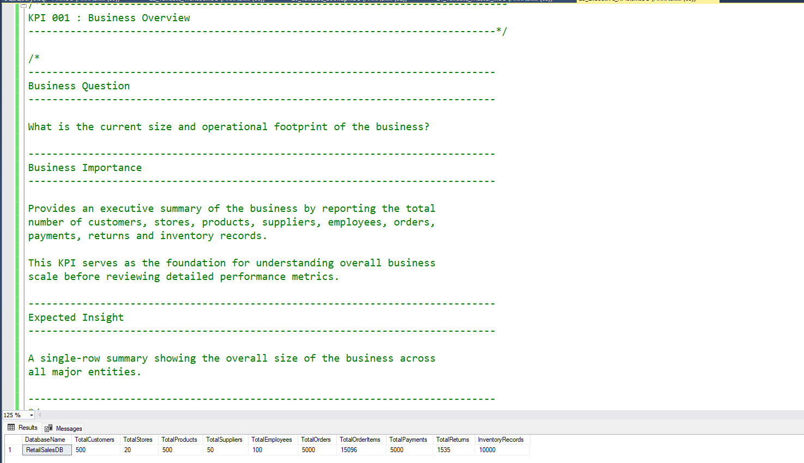

# 🛒 Retail Sales Analytics & Inventory Management System

<<<<<<< HEAD
A production-inspired **Microsoft SQL Server** project that simulates the operations of a modern retail business. This project demonstrates end-to-end database design, data modeling, normalization, SQL development, data generation, performance optimization, and business analytics.

Designed as a portfolio project for **Data Analyst**, **SQL Developer**, and **Business Intelligence** roles, it showcases industry-standard database development practices and serves as the foundation for interactive Power BI dashboards.

---

## Project Information

| Property | Value |
|----------|-------|
| **Project** | Retail Sales Analytics & Inventory Management System |
| **Database** | RetailSalesDB |
| **Database Platform** | Microsoft SQL Server |
| **Query Language** | T-SQL |
| **Project Type** | End-to-End SQL Portfolio Project |
| **Architecture** | Relational Database (3NF) |
| **Reporting Tool** | Microsoft Power BI *(Planned)* |
| **Author** | Akshay Aswani |
| **Status** | 🚧 Active Development (120 / 375 KPIs Completed) |

---

## Key Highlights

- Production-inspired retail database
- Third Normal Form (3NF) database design
- Lookup, Master, and Transaction tables
- Primary & Foreign Key relationships
- CHECK, DEFAULT, and UNIQUE constraints
- Clustered & Non-Clustered Indexes
- Enterprise-style SQL documentation
- Realistic business data generation
- Advanced SQL analytics
- Power BI ready database
- Git & GitHub version control

---

## Table of Contents

1. [Project Overview](#1-project-overview)
2. [Business Problem](#2-business-problem)
3. [Project Objectives](#3-project-objectives)
4. [Project Scope](#4-project-scope)
5. [Technology Stack](#5-technology-stack)
6. [Database Overview](#6-database-overview)
7. [Database Statistics](#7-database-statistics)
8. [Database Architecture](#8-database-architecture)
9. [Entity Relationship Diagram](#9-entity-relationship-diagram)
10. [Project Structure](#10-project-structure)
11. [SQL Features Implemented](#11-sql-features-implemented)
12. [Documentation](#12-documentation)
13. [Project Workflow](#13-project-workflow)
14. [Power BI Dashboard](#14-power-bi-dashboard)
15. [Setup Instructions](#15-setup-instructions)
16. [Project Status](#16-project-status)
17. [Learning Outcomes](#17-learning-outcomes)
18. [Future Enhancements](#18-future-enhancements)
19. [License](#19-license)
20. [Author](#20-author)

---

# 1. Project Overview

Retail organizations generate large volumes of transactional data every day across products, stores, customers, employees, suppliers, payments, and inventory. Managing this information efficiently requires a well-designed relational database that supports both operational processes and analytical reporting.

The **Retail Sales Analytics & Inventory Management System** is an end-to-end SQL Server database project that simulates a real-world retail environment. The project has been designed following Microsoft SQL Server best practices and demonstrates the complete lifecycle of relational database development—from database design and normalization to data generation, performance optimization, SQL analysis, and business intelligence reporting.

This project serves as a comprehensive portfolio showcasing practical SQL development skills, data modeling techniques, and documentation standards commonly used in enterprise environments.

---

## Project Goals

The primary goals of this project are to:

- Design a scalable relational database
- Apply Third Normal Form (3NF) normalization
- Implement robust data integrity using constraints
- Generate realistic business data
- Perform advanced SQL analysis
- Build business-ready reporting datasets
- Develop interactive Power BI dashboards
- Demonstrate enterprise SQL Server development practices

---

## Intended Audience

This repository is intended for:

- Recruiters reviewing SQL portfolios
- Hiring Managers
- Data Analysts
- SQL Developers
- Database Developers
- Business Intelligence Professionals
- Students learning SQL Server
- Anyone interested in relational database design

---

## Why This Project?

Unlike small SQL practice databases, this project follows a production-inspired approach by combining:

- Professional database design
- Enterprise documentation
- Realistic business scenarios
- Scalable architecture
- SQL Server best practices
- Analytics-ready schema

The result is a complete portfolio project that demonstrates both technical implementation and documentation skills expected in professional data-focused roles.

---

# 2. Business Problem

Modern retail businesses generate thousands of transactions every day across multiple stores, products, customers, suppliers, and payment channels. Managing this operational data efficiently requires a well-designed relational database that ensures data consistency, supports business operations, and enables analytical reporting.

Without a structured database, organizations often face challenges such as:

- Duplicate and inconsistent data
- Poor inventory visibility
- Difficulty tracking customer purchasing behavior
- Inefficient sales reporting
- Limited business insights
- Slow query performance
- Poor scalability as the business grows

To address these challenges, businesses rely on normalized relational databases that maintain data integrity while supporting both transactional processing (OLTP) and business intelligence reporting.

This project simulates a real-world retail database by implementing industry-standard database design principles and SQL Server best practices.

---

# 3. Project Objectives

The primary objective of this project is to design and implement a scalable, production-inspired retail database using Microsoft SQL Server.

The project aims to demonstrate practical database development skills that are commonly required for Data Analyst, SQL Developer, and Business Intelligence roles.

## Objectives

- Design a normalized relational database (3NF)
- Implement Primary Key and Foreign Key relationships
- Enforce business rules using SQL constraints
- Generate realistic retail business data
- Optimize query performance using indexes
- Build reusable SQL objects such as Views, Stored Procedures, Functions, and Triggers
- Perform business analysis using advanced SQL queries
- Create datasets optimized for Power BI reporting
- Follow enterprise SQL Server development standards
- Maintain comprehensive project documentation

---

# 4. Project Scope

The Retail Sales Analytics & Inventory Management System covers the core business operations of a retail organization.

## Included Modules

### Product Management

- Category Management
- SubCategory Management
- Brand Management
- Supplier Management
- Product Catalog

---

### Store Management

- Store Information
- Employee Management

---

### Customer Management

- Customer Registration
- Customer Information

---

### Inventory Management

- Product Inventory
- Stock Availability
- Inventory Tracking

---

### Sales Management

- Customer Orders
- Order Items
- Sales Transactions

---

### Payment Management

- Payment Processing
- Payment Methods
- Payment Status Tracking

---

### Return Management

- Product Returns
- Return Reasons
- Return Status Tracking
- Refund Information

---

### Business Analytics

- Sales Analysis
- Customer Analysis
- Product Performance
- Inventory Analysis
- Supplier Performance
- Store Performance
- Return Analysis

---

## Out of Scope

The following features are intentionally excluded from the current version of the project:

- Online shopping cart
- User authentication
- Product reviews and ratings
- Shipment and logistics tracking
- Multi-currency support
- Multi-language support
- Tax calculation engine
- Discount and coupon engine
- Mobile application
- Web application

These features may be included in future project versions.

---

# 5. Technology Stack

The project is developed using Microsoft technologies and follows SQL Server best practices.

| Category | Technology |
|----------|------------|
| Database Platform | Microsoft SQL Server |
| Query Language | T-SQL |
| Database IDE | SQL Server Management Studio (SSMS) |
| Data Modeling | Relational Database Design |
| Documentation | Markdown |
| Version Control | Git |
| Repository Hosting | GitHub |
| ER Diagram | Draw.io |
| Reporting & Visualization | Microsoft Power BI *(Planned)* |

---

## SQL Server Features Used

The project demonstrates a wide range of SQL Server capabilities, including:

### Database Design

- Database Creation
- Table Design
- Data Modeling
- Normalization (3NF)

---

### Constraints

- Primary Keys
- Foreign Keys
- CHECK Constraints
- DEFAULT Constraints
- UNIQUE Constraints

---

### Performance

- Clustered Indexes
- Non-Clustered Indexes
- Query Optimization
- Indexing Strategy

---

### Programmability *(Upcoming)*

- Views
- Stored Procedures
- User Defined Functions (UDFs)
- Triggers
- Transactions

---

### SQL Analytics

- JOINs
- Aggregate Functions
- Window Functions
- Ranking Functions
- CASE Expressions
- CTEs
- Business KPI Queries (120)

---

## Development Workflow

The project follows a structured development lifecycle to ensure consistency, maintainability, and scalability.

```text
Business Requirements
          │
          ▼
Database Design
          │
          ▼
Table Creation
          │
          ▼
Constraints
          │
          ▼
Indexes
          │
          ▼
Master Data
          │
          ▼
Transaction Data
          │
          ▼
SQL Analysis
          │
          ▼
Power BI Dashboard
          │
          ▼
Documentation
```

This workflow reflects the order in which the project is being developed and aligns with common database development practices.

---

# 6. Database Overview

The **RetailSalesDB** is a production-inspired relational database designed to simulate the day-to-day operations of a retail organization.

The database supports multiple business domains, including product management, inventory tracking, customer management, sales processing, payment management, and product returns.

It has been designed following Microsoft SQL Server best practices to ensure scalability, maintainability, and high-performance querying.

---

## Database Design Principles

The database was developed using the following design principles:

- Third Normal Form (3NF)
- Surrogate Primary Keys (`INT IDENTITY`)
- Referential Integrity
- Lookup Table Design
- Modular Architecture
- Enterprise Naming Conventions
- Optimized Indexing Strategy
- Audit Columns for Data Tracking
- Scalable Schema Design

---

## Database Modules

The database is organized into logical business modules.

| Module | Description |
|----------|-------------|
| Product Management | Categories, SubCategories, Brands, Suppliers and Products |
| Store Management | Stores and Employees |
| Customer Management | Customer Information |
| Inventory Management | Product Stock Tracking |
| Sales Management | Orders and Order Items |
| Payment Management | Payment Processing |
| Return Management | Product Returns and Refund Tracking |
| Business Analytics | Reporting and Power BI |

---

# 7. Database Statistics

The current database consists of **18 relational tables** organized into three logical categories.

| Database Object | Count |
|-----------------|------:|
| Total Tables | 18 |
| Lookup Tables | 9 |
| Master Tables | 4 |
| Transaction Tables | 5 |
| Primary Keys | 18 |
| Foreign Keys | 18 |
| CHECK Constraints | Multiple |
| DEFAULT Constraints | Multiple |
| UNIQUE Constraints | Multiple |
| Clustered Indexes | 18 |
| Non-Clustered Indexes | Multiple |

---

## Table Classification

### Lookup Tables

These tables store reusable reference data used throughout the system.

- Category
- SubCategory
- Brand
- Supplier
- PaymentMethod
- OrderStatus
- PaymentStatus
- ReturnReason
- ReturnStatus

---

### Master Tables

These tables represent the primary business entities.

- Product
- Store
- Employee
- Customer

---

### Transaction Tables

These tables record day-to-day business operations.

- Inventory
- Order
- OrderItem
- Payment
- Return

---

# 8. Database Architecture

The RetailSalesDB follows a layered relational architecture that separates reusable reference data, business entities, and transactional records.

```text
                    Lookup Tables
                          │
        ┌─────────────────┼──────────────────┐
        ▼                 ▼                  ▼
   Category            Brand            Supplier
        │
        ▼
  SubCategory
        │
        ▼

                 Master Tables

        Product      Store      Employee     Customer
            │            │
            │            ▼
            │       Inventory
            │
            ▼

              Transaction Tables

Order ─────────► OrderItem ─────────► Return
  │
  ▼
Payment
```

---

## Architecture Benefits

- Clear separation of responsibilities
- Reduced data redundancy
- Improved maintainability
- Better query performance
- Easier scalability
- Enterprise-ready structure
- Optimized for Power BI reporting

---

# 9. Entity Relationship Diagram

The Entity Relationship Diagram (ERD) provides a visual representation of the database structure, including all tables, primary keys, foreign keys, and relationships.

It serves as the blueprint for the database and helps developers understand how business entities are connected.

---
=======
### Enterprise SQL Portfolio Project | SQL Server | Business Intelligence | Retail Analytics
>>>>>>> 1c1d022 (modified the README.md and rename the file)

<p align="center">


</p>

---

A comprehensive **Retail Sales Analytics & Inventory Management System** built entirely using **Microsoft SQL Server**.

This project simulates a real-world retail environment by designing a normalized relational database, generating large-scale business data, and implementing **375 business-focused SQL KPIs** covering Sales, Customers, Products, Inventory, Stores, Employees, Finance, and Executive Reporting.

The objective of this project is to demonstrate advanced SQL skills while solving real business problems through data analysis and reporting.

# 🚀 Project Overview

## 📌 Business Problem

Retail organizations generate large volumes of transactional data every day, including sales, inventory movements, customer purchases, payments, and product information. Without an effective analytics system, it becomes difficult to answer critical business questions such as:

- Which products generate the highest revenue?
- Which customers contribute the most sales?
- Which products require immediate replenishment?
- Which stores are performing well?
- How do monthly and yearly sales trends compare?
- Which inventory items are overstocked or understocked?
- Which products have never been sold?
- Which employees and stores achieve the highest sales performance?

To support better decision-making, businesses require structured data models, reliable reporting, and meaningful Key Performance Indicators (KPIs).

---

## 🎯 Project Objectives

This project was built to simulate a real-world Retail Sales Analytics solution using Microsoft SQL Server.

The primary objectives are:

- Design a fully normalized retail database using SQL Server.
- Generate realistic business data for analysis.
- Implement **375 business-focused SQL KPIs** covering multiple business domains.
- Apply advanced SQL techniques to solve real business problems.
- Build production-quality database documentation.
- Demonstrate industry-standard SQL development practices.
- Create a portfolio project suitable for Data Analyst and Business Intelligence roles.

---

## 💼 Business Value

This solution enables business users to:

- 📈 Monitor sales performance across products, categories, stores, and employees.
- 👥 Understand customer purchasing behavior.
- 📦 Optimize inventory levels and reduce stock-related issues.
- 💰 Track revenue and business growth.
- 🏪 Evaluate store performance using operational KPIs.
- 📊 Support executive decision-making using data-driven insights.
- ⚡ Improve reporting efficiency through reusable SQL analytics.

---

## 🎓 Learning Outcomes

Through this project, the following technical skills are demonstrated:

- Database Design
- Data Modeling
- SQL Query Development
- Business KPI Development
- Window Functions
- Common Table Expressions (CTEs)
- Aggregate Analysis
- Ranking Functions
- Reporting Queries
- Performance-Oriented SQL Development
- Business Documentation
- Git & GitHub Version Control

# 📊 Project Status

| Property | Details |
|----------|---------|
| **Project Version** | v1.2 |
| **Development Status** | 🚧 Active Development |
| **Current Phase** | Product & Inventory Analytics |
| **Database** | Microsoft SQL Server |
| **Total Planned KPIs** | 375 |
| **KPIs Completed** | 120 |
| **Project Completion** | 32% |
| **Current Module** | Inventory Analytics (KPI 116–120) |
| **Next Module** | Store Performance Analytics (KPI 121–140) |

---

## 📈 Development Progress

| Module | KPI Range | Status |
|---------|-----------|--------|
| 📊 Business Overview | 001–020 | ✅ Completed |
| 💰 Sales Analytics | 021–050 | ✅ Completed |
| 👥 Customer Analytics | 051–080 | ✅ Completed |
| 📦 Product Analytics | 081–115 | ✅ Completed |
| 🏪 Inventory Analytics | 116–120 | ✅ Completed |
| 🏬 Store Analytics | 121–140 | ⏳ Planned |
| 👨‍💼 Employee Analytics | 141–170 | ⏳ Planned |
| 💵 Financial Analytics | 171–220 | ⏳ Planned |
| ⚡ Advanced SQL Analytics | 221–300 | ⏳ Planned |
| 📈 Executive Reporting | 301–375 | ⏳ Planned |

---

## 🎯 Current Milestone

✅ **120 Business KPIs Completed**

Current focus:

- Product Performance Analytics
- Inventory Analytics
- Advanced Business KPI Development
- SQL Performance Optimization
- Enterprise SQL Best Practices

---

## 🚀 Upcoming Milestone

**Store Performance Analytics (KPI 121–140)**

Upcoming topics include:

- Store Revenue Analysis
- Top Performing Stores
- Store-wise Orders
- Store-wise Inventory
- Store Profitability
- Store Growth Analysis
- Store Ranking
- Regional Performance Analysis

# ⭐ Project Highlights

This project has been designed to replicate a real-world **Retail Sales Analytics & Inventory Management System** used by modern retail organizations. It follows industry-standard database design principles, enterprise SQL development practices, and business-focused analytics.

---

## 🏗️ Enterprise Database Design

- Fully normalized relational database (3NF)
- Production-ready SQL Server database design
- Well-defined Primary Keys, Foreign Keys, Constraints, and Indexes
- Scalable schema supporting multiple business domains
- Business-friendly naming conventions throughout the project

---

## 📊 Comprehensive Business Analytics

This project aims to implement **375 business-focused SQL KPIs** covering multiple functional areas, including:

- 📈 Business Overview
- 💰 Sales Analytics
- 👥 Customer Analytics
- 📦 Product Analytics
- 🏪 Inventory Analytics
- 🏬 Store Analytics
- 👨‍💼 Employee Analytics
- 💵 Financial Analytics
- 📊 Executive Reporting

Current Progress:
- ✅ **120 KPIs Completed**

---

## 🧠 Advanced SQL Concepts

The project demonstrates practical usage of advanced SQL Server features, including:

- INNER JOIN / LEFT JOIN
- Common Table Expressions (CTEs)
- Aggregate Functions
- CASE Expressions
- Window Functions
- Ranking Functions
- NULL Handling
- Business Logic Implementation
- Inventory Coverage Analysis
- Performance-Oriented Query Design

Additional advanced SQL concepts will be introduced in later phases, including:

- LAG() / LEAD()
- FIRST_VALUE() / LAST_VALUE()
- NTILE()
- PERCENT_RANK()
- CUME_DIST()
- Stored Procedures
- User Defined Functions
- Views
- Dynamic Reporting Queries

---

## 📚 Professional Documentation

Comprehensive project documentation has been created to simulate enterprise software documentation.

Current documentation includes:

- ✅ Business Requirements
- ✅ Project Architecture
- ✅ Naming Conventions
- ✅ Data Dictionary
- ✅ Database Design Decisions
- ✅ Entity Relationship Diagram (ERD)

---

## 📂 Well-Organized Repository

The repository follows a modular folder structure for easy navigation and maintenance.

It includes:

- SQL Scripts
- Documentation
- Sample Data
- Database Objects
- KPI Library
- Supporting Assets

---

## 💼 Industry-Oriented Portfolio Project

Unlike small SQL practice projects, this repository focuses on solving real business problems faced by retail organizations.

Examples include:

- Revenue Analysis
- Customer Behavior Analysis
- Inventory Optimization
- Product Performance
- Business Growth Analysis
- Executive Reporting
- Operational KPIs

The objective is to demonstrate practical SQL skills expected from **Data Analysts**, **Business Intelligence Analysts**, and **SQL Developers**.

# 🛠️ Technology Stack

This project leverages industry-standard technologies for database design, SQL development, documentation, and version control.

---

## 💻 Database

| Technology | Purpose |
|------------|---------|
| Microsoft SQL Server | Primary Relational Database Management System |
| SQL Server Management Studio (SSMS) | Database Development & Query Execution |
| T-SQL | Database Programming Language |

---

## 📊 SQL Development

The project demonstrates practical implementation of:

- Database Design
- Data Modeling
- SQL Query Development
- Business KPI Development
- Data Analysis
- Reporting Queries
- Query Optimization

---

## ⚙️ SQL Features Used

### Database Objects

- Database
- Tables
- Constraints
- Primary Keys
- Foreign Keys
- Unique Constraints
- Default Constraints
- Indexes

---

### Query Techniques

- SELECT
- WHERE
- GROUP BY
- HAVING
- ORDER BY
- CASE Expressions
- Aggregate Functions
- Subqueries
- Common Table Expressions (CTEs)

---

### Window Functions

- ROW_NUMBER()
- RANK()
- DENSE_RANK()

Upcoming:

- LAG()
- LEAD()
- NTILE()
- FIRST_VALUE()
- LAST_VALUE()
- PERCENT_RANK()
- CUME_DIST()

---

### Data Analysis

- Sales Analysis
- Customer Analysis
- Product Analysis
- Inventory Analysis
- Business KPI Reporting

---

## 📂 Version Control

| Tool | Purpose |
|------|---------|
| Git | Version Control |
| GitHub | Source Code Hosting & Portfolio |

---

## 📝 Documentation

Project documentation is maintained using Markdown and includes:

- Business Requirements
- Project Architecture
- Data Dictionary
- Naming Conventions
- Database Design Decisions
- Entity Relationship Diagram (ERD)

---

## 🚀 Future Integrations

Planned integrations include:

- Power BI Dashboard
- Stored Procedures
- Views
- User Defined Functions
- Dynamic SQL
- Performance Benchmarking

# 🏛️ Database Architecture

The Retail Sales Analytics & Inventory Management System is built using a fully normalized relational database following **Third Normal Form (3NF)** to ensure data integrity, scalability, and maintainability.

The database is organized into three logical layers commonly used in enterprise database design.

---

# 📚 Database Layers

## 1️⃣ Lookup Tables

Lookup tables store static reference data that rarely changes and eliminate duplicate values throughout the database.

### Tables

| Table |
|--------|
| Brand |
| Category |
| OrderStatus |
| PaymentMethod |
| PaymentStatus |
| ReturnReason |
| ReturnStatus |
| SubCategory |

---

## 2️⃣ Master Tables

Master tables store core business entities used across multiple business processes.

### Tables

| Table |
|--------|
| Customer |
| Employee |
| Product |
| Supplier |
| Store |
| Inventory |

---

## 3️⃣ Transaction Tables

Transaction tables capture day-to-day business activities and continuously grow as business operations continue.

### Tables

| Table |
|--------|
| Order |
| OrderItem |
| Payment |
| Return |

---

# 🔗 Entity Relationships

The database is designed using well-defined relationships to maintain referential integrity.

Examples include:

- One Category → Many SubCategories
- One Brand → Many Products
- One Supplier → Many Products
- One Product → Many Inventory Records
- One Store → Many Inventory Records
- One Customer → Many Orders
- One Employee → Many Orders
- One Order → Many Order Items
- One Order → One Payment
- One Order Item → Many Returns

---

# 📐 Database Design Principles

The database follows industry-standard design practices.

### ✔ Normalization

- Third Normal Form (3NF)
- Elimination of data redundancy
- Improved data consistency

---

### ✔ Data Integrity

Implemented using:

- Primary Keys
- Foreign Keys
- Unique Constraints
- Default Constraints

---

### ✔ Performance Optimization

Performance improvements include:

- Clustered Primary Keys
- Non-Clustered Indexes
- Optimized JOIN relationships
- Query-friendly table design

---

### ✔ Scalability

The schema has been designed to support future enhancements, including:

- Multiple Store Locations
- Additional Payment Methods
- Product Promotions
- Customer Loyalty Programs
- Sales Forecasting
- Business Intelligence Dashboards

---

# 🗂️ Database Statistics

| Property | Value |
|-----------|-------|
| Database | RetailSalesDB |
| Database Platform | Microsoft SQL Server |
| Database Design | Relational |
| Normalization | Third Normal Form (3NF) |
| Total Tables | 18 |
| Lookup Tables | 8 |
| Master Tables | 6 |
| Transaction Tables | 4 |
| Primary Keys | 18 |
| Foreign Keys | 20+ |
| Business KPIs | 375 (Planned) |

# 📂 Project Structure

The repository is organized into modular components following a logical development lifecycle—from database creation to business analytics and reporting.

```text
Retail-Sales-Analytics/

├── 01_Database_Setup/
├── 02_Data_Generation/
├── 03_Database_Objects/
├── 04_Data_Validation/
├── 05_Database_Maintenance/
├── 06_Business_Analysis/
├── 07_Business_Analysis_Output/
├── 08_PowerBI/
├── 09_Datasets/
├── 10_Execution_Order/
├── 11_Documentation/
├── 12_Case_Study/
```

---

## 📁 Repository Modules

| Folder | Description |
|----------|-------------|
| **01_Database_Setup** | Creates the database, tables, constraints, and indexes. |
| **02_Data_Generation** | Generates realistic lookup, master, transaction, inventory, payment, and return data. |
| **03_Database_Objects** | Contains reusable database objects such as Views, Stored Procedures, Functions, and Triggers. |
| **04_Data_Validation** | Validates schema, constraints, indexes, data quality, and business rules after data generation. |
| **05_Database_Maintenance** | Database maintenance tasks and SQL performance optimization scripts. |
| **06_Business_Analysis** | Business-focused SQL analysis scripts covering multiple business domains and KPI reporting. |
| **07_Business_Analysis_Output** | Contains execution results, screenshots, exported datasets, and supporting documentation for every business KPI organized by business module. |
| **08_PowerBI** | Interactive Power BI dashboards built using the SQL database. |
| **09_Datasets** | Source datasets, Excel files, CSV files, and ER Diagram resources. |
| **10_Execution_Order** | Master execution script for running the complete project in the correct sequence. |
| **11_Documentation** | Complete project documentation including architecture, ER diagram, data dictionary, naming conventions, and technical guides. |
| **12_Case_Study** | Business case study explaining objectives, KPIs, insights, recommendations, and future improvements. |

---

## 📌 Repository Highlights

- ✅ Modular Enterprise Folder Structure
- ✅ End-to-End SQL Development Lifecycle
- ✅ Production-Oriented Database Design
- ✅ Comprehensive Documentation
- ✅ Business KPI Library
- ✅ Power BI Integration
- ✅ Organized Analytical Outputs
- ✅ Case Study & Business Recommendations

# 📚 Project Documentation

Comprehensive documentation has been created to ensure the project is easy to understand, maintain, and extend. Each document focuses on a specific aspect of the database design, implementation, or business analysis.

---

## 📖 Documentation Library

| Document | Description | Status |
|----------|-------------|--------|
| 📄 **Business_Requirements.md** | Defines project objectives, business requirements, scope, stakeholders, and assumptions. | ✅ |
| 🏛️ **Project_Architecture.md** | Explains the overall architecture, development workflow, and project organization. | ✅ |
| 📐 **Naming_Conventions.md** | Standard naming conventions for databases, tables, columns, constraints, indexes, and SQL objects. | ✅ |
| 📚 **Data_Dictionary.md** | Complete reference for tables, columns, keys, relationships, and business definitions. | ✅ |
| 🗺️ **ER_Diagram.md** | Entity Relationship Diagram with table relationships and database structure. | ✅ |
| ⚙️ **Database_Design_Decisions.md** | Design choices including normalization, indexing strategy, constraints, and scalability considerations. | ✅ |
| 👁️ **Views_Documentation.md** | Documentation for all SQL Views implemented in the project. | ⏳ Planned |
| ⚡ **Stored_Procedures_Documentation.md** | Documentation for reusable stored procedures. | ⏳ Planned |
| 🔧 **Functions_Documentation.md** | Documentation for scalar and table-valued functions. | ⏳ Planned |
| 🔄 **Triggers_Documentation.md** | Documentation for database triggers and automation logic. | ⏳ Planned |
| 🛠️ **Maintenance_Guide.md** | Database maintenance tasks, backups, and optimization guidelines. | ⏳ Planned |
| 🚀 **Performance_Optimization.md** | Query tuning, indexing strategies, and performance improvements. | ⏳ Planned |
| 📊 **Business_Query_Explanations.md** | Business logic and explanations behind analytical SQL queries and KPIs. | 🚧 In Progress |

---

## 🎯 Documentation Objectives

The documentation has been designed to:

- Provide a clear understanding of the database architecture.
- Explain business rules and analytical requirements.
- Standardize development using consistent naming conventions.
- Support future enhancements and scalability.
- Simulate enterprise-level project documentation.

# 📊 Business KPI Library

The Retail Sales Analytics & Inventory Management System includes a comprehensive collection of business-focused SQL analytics designed to simulate real-world reporting requirements.

The KPI library is organized into logical business domains, making it easy to explore different aspects of retail operations.

---

## 📈 KPI Progress

| Module | KPI Range | Planned | Completed | Status |
|----------|-----------|----------|------------|--------|
| Executive KPIs | 001–020 | 20 | 20 | ✅ |
| Sales Analysis | 021–050 | 30 | 30 | ✅ |
| Customer Analysis | 051–065 | 15 | 15 | ✅ |
| Customer Behavior | 066–080 | 15 | 15 | ✅ |
| Product Analysis | 081–115 | 35 | 35 | ✅ |
| Inventory Analysis | 116–120 | 5 | 5 | ✅ |
| Employee Performance | 121–140 | 20 | 0 | ⏳ |
| Return Analysis | 141–160 | 20 | 0 | ⏳ |
| Payment Analysis | 161–180 | 20 | 0 | ⏳ |
| Supplier Analysis | 181–200 | 20 | 0 | ⏳ |
| Time Series Analysis | 201–240 | 40 | 0 | ⏳ |
| Advanced SQL Analysis | 241–340 | 100 | 0 | ⏳ |
| Executive Business Reports | 341–375 | 35 | 0 | ⏳ |

---

## 📌 Current Progress

| Metric | Value |
|---------|------:|
| Total Planned KPIs | **375** |
| Completed KPIs | **120** |
| Remaining KPIs | **255** |
| Completion Progress | **32%** |

---

## 📂 KPI Organization

Each KPI follows a standardized structure.

```text
06_Business_Analysis/

├── Executive_KPIs/
├── Sales_Analysis/
├── Customer_Analysis/
├── Customer_Behavior/
├── Product_Analysis/
├── Inventory_Analysis/
├── Employee_Performance/
├── Return_Analysis/
├── Payment_Analysis/
├── Supplier_Analysis/
├── Time_Series_Analysis/
├── Advanced_SQL_Analysis/
└── Executive_Business_Report/
```

---

## 📸 KPI Documentation

Every KPI is documented with supporting material.

```text
07_Business_Analysis_Output/

KPI_001_Business_Overview/

├── Business_Context.png
└── Query_And_Output.png
```

Each KPI folder contains:

- 📄 Business Context
- 💻 SQL Query
- 📊 Query Result
- ✅ Business Insight

---

## 🧠 SQL Concepts Covered

The KPI library demonstrates practical use of:

- Aggregate Functions
- CASE Expressions
- CTEs (Common Table Expressions)
- Window Functions
- Ranking Functions
- Running Totals
- Moving Averages
- Conditional Aggregation
- Date & Time Functions
- Correlated Subqueries
- EXISTS / NOT EXISTS
- PIVOT & UNPIVOT *(Planned)*
- Dynamic SQL *(Planned)*
- Query Optimization Techniques *(Planned)*

---

## 🎯 Business Domains Covered

- Executive Reporting
- Sales Performance
- Customer Analytics
- Customer Behavior
- Product Performance
- Inventory Management
- Employee Performance
- Return Analysis
- Payment Analysis
- Supplier Performance
- Time Series Analysis
- Advanced SQL Analytics
- Executive Business Reporting

# 📈 Power BI Dashboards

The SQL database serves as the backend for a collection of interactive Power BI dashboards designed to provide actionable business insights.

Each dashboard focuses on a specific business function, enabling decision-makers to monitor KPIs, identify trends, and make data-driven decisions.

---

## 📊 Dashboard Library

| Dashboard | Description | Status |
|-----------|-------------|--------|
| 👔 Executive Summary | High-level overview of business performance with key KPIs and trends. | ⏳ Planned |
| 💰 Sales Dashboard | Revenue, sales trends, top-selling products, regional performance, and sales KPIs. | ⏳ Planned |
| 👥 Customer Dashboard | Customer growth, segmentation, retention, purchasing behavior, and lifetime value. | ⏳ Planned |
| 📦 Product Dashboard | Product performance, category analysis, top/bottom products, and profitability. | ⏳ Planned |
| 🏪 Inventory Dashboard | Stock levels, inventory turnover, reorder alerts, and inventory health. | ⏳ Planned |
| 👨‍💼 Employee Dashboard | Sales performance, productivity, and employee contribution analysis. | ⏳ Planned |
| ↩️ Returns Dashboard | Return trends, return reasons, product return rates, and financial impact. | ⏳ Planned |

---

## 🎯 Dashboard Features

Each dashboard includes:

- Interactive Filters & Slicers
- Drill-through Navigation
- KPI Cards
- Trend Analysis
- Dynamic Charts & Visualizations
- Conditional Formatting
- Executive-Level Reporting

---

## 🔄 Data Flow

```text
SQL Server Database
        │
        ▼
Business KPI Queries
        │
        ▼
Power Query
        │
        ▼
Data Model
        │
        ▼
DAX Measures
        │
        ▼
Interactive Power BI Dashboards
```

---

## 🛠️ Power BI Skills Demonstrated

- Data Modeling
- Star Schema Design
- DAX Measures & Calculated Columns
- Power Query (M Language)
- Drill-through Reports
- Bookmarks & Navigation
- KPI Cards
- Dynamic Titles
- Conditional Formatting
- Performance Optimization

---

## 📂 Dashboard Location

```text
08_PowerBI/

├── Executive Dashboard
├── Sales Dashboard
├── Customer Dashboard
├── Product Dashboard
├── Inventory Dashboard
├── Employee Dashboard
└── Returns Dashboard
```

# 🚀 Getting Started

Follow the steps below to set up and execute the complete Retail Sales Analytics & Inventory Management System.

---

## 📋 Prerequisites

Before running the project, ensure you have the following installed:

- Microsoft SQL Server (2019 or later)
- SQL Server Management Studio (SSMS)
- Power BI Desktop *(Optional for dashboard visualization)*
- Git

---

## 📥 Clone the Repository

```bash
git clone https://github.com/aaswani365/Retail-Sales-Analytics.git
cd Retail-Sales-Analytics
```

---

## ▶️ Project Execution Order

Execute the SQL scripts in the following sequence.

| Step | Folder | Purpose |
|------|---------|----------|
| 1 | 01_Database_Setup | Create database, tables, constraints, and indexes |
| 2 | 02_Data_Generation | Generate lookup, master, transaction, payment, return, and inventory data |
| 3 | 03_Database_Objects | Create Views, Stored Procedures, Functions, and Triggers |
| 4 | 04_Data_Validation | Validate schema, data quality, constraints, and business rules |
| 5 | 05_Database_Maintenance | Run maintenance and optimization scripts |
| 6 | 06_Business_Analysis | Execute business KPI queries |
| 7 | 08_PowerBI | Connect Power BI to SQL Server and refresh dashboards *(Optional)* |

---

## ⚡ Quick Start

Alternatively, execute the master script:

```sql
10_Execution_Order/Run_Project.sql
```

This script executes all project modules in the correct order.

---

## 📊 Verify the Setup

After successful execution, verify that:

- Database is created successfully
- All tables contain generated data
- Views compile successfully
- Stored Procedures execute correctly
- Business KPI queries return results
- Data validation scripts complete without errors

---

## 📈 Expected Dataset Size

| Object | Approximate Records |
|---------|-------------------:|
| Customers | 5,000 |
| Employees | 200 |
| Products | 500 |
| Orders | 20,000 |
| Order Items | 50,000+ |
| Payments | 20,000 |
| Returns | 2,000+ |
| Inventory Records | 2,000+ |

---

## 📌 Notes

- Execute scripts in the recommended order.
- Do not skip data generation scripts.
- Validation scripts should be executed after all data has been generated.
- Power BI dashboards require the SQL database to be fully populated.

# 🖼️ Project Showcase

The following screenshots demonstrate different stages of the project, from database design to SQL analytics and Power BI reporting.

---

## 🗺️ Database Design

### Entity Relationship Diagram

> Complete ER Diagram illustrating table relationships and database architecture.

<p align="center">

</p>

---

## 📂 SQL Business KPI Library

Every KPI is documented with business context and SQL execution output.

Example:

```text
07_Business_Analysis_Output/

KPI_001_Business_Overview/

├── Business_Context.png
└── Query_And_Output.png
```

---

## 📊 Sample KPI Output

### Business Context

<p align="center">

</p>

---

### SQL Query & Output

<p align="center">

</p>

---

## 📈 Power BI Dashboards

Interactive dashboards built using the SQL database.

| Dashboard | Preview |
|------------|---------|
| Executive Dashboard | 🚧 Coming Soon |
| Sales Dashboard | 🚧 Coming Soon |
| Customer Dashboard | 🚧 Coming Soon |
| Product Dashboard | 🚧 Coming Soon |
| Inventory Dashboard | 🚧 Coming Soon |
| Employee Dashboard | 🚧 Coming Soon |
| Returns Dashboard | 🚧 Coming Soon |

---

## 🖥️ SQL Server

The project is developed using Microsoft SQL Server Management Studio (SSMS).

Features demonstrated:

- Database Design
- Data Generation
- Stored Procedures
- Views
- Functions
- Triggers
- Advanced SQL Analytics
- Performance Optimization

---

## 📌 Repository Growth

As the project progresses, additional screenshots will be added for:

- Power BI Reports
- SQL Execution Results
- Dashboard Walkthroughs
- Business Case Studies
- KPI Visualizations

# 🎯 Skills Demonstrated

This project simulates a real-world retail analytics environment and demonstrates end-to-end SQL development, database design, business intelligence, and analytical problem-solving.

---

## 💾 Database Design

- Database Modeling
- Entity Relationship Design (ERD)
- Normalization (3NF)
- Primary & Foreign Keys
- Constraints
- Indexing Strategy
- Data Integrity
- Scalable Database Design

---

## 🛠 SQL Development

- DDL (CREATE, ALTER, DROP)
- DML (INSERT, UPDATE, DELETE)
- Views
- Stored Procedures
- User Defined Functions (UDFs)
- Triggers
- Transactions
- Error Handling

---

## 📊 SQL Analytics

- Aggregate Functions
- CASE Expressions
- Common Table Expressions (CTEs)
- Window Functions
- Ranking Functions
- Running Totals
- Moving Averages
- Date & Time Functions
- Conditional Aggregation
- Correlated Subqueries
- EXISTS / NOT EXISTS
- CROSS APPLY / OUTER APPLY *(Planned)*
- PIVOT & UNPIVOT *(Planned)*
- Dynamic SQL *(Planned)*

---

## 📈 Business Intelligence

- KPI Development
- Executive Reporting
- Business Analysis
- Customer Analytics
- Product Analytics
- Inventory Analytics
- Sales Performance Analysis
- Time Series Analysis
- Financial Reporting

---

<<<<<<< HEAD
## Documentation Highlights

The documentation covers:

- Business requirements
- Database architecture
- Naming standards
- Data dictionary
- Database design decisions
- Entity relationship diagram
- SQL development standards
- Best practices

Together, these documents provide a complete technical reference for understanding, maintaining, and extending the database.

---

# 13. Project Workflow

The project follows a structured database development lifecycle.

```text
Business Requirements
          │
          ▼
Database Design
          │
          ▼
ER Diagram
          │
          ▼
Database Creation
          │
          ▼
Table Creation
          │
          ▼
Constraints
          │
          ▼
Indexes
          │
          ▼
Lookup Data
          │
          ▼
Master Data
          │
          ▼
Transaction Data
          │
          ▼
Views
          │
          ▼
Stored Procedures
          │
          ▼
Functions
          │
          ▼
Triggers
          │
          ▼
SQL Analysis
          │
          ▼
Performance Tuning
          │
          ▼
Power BI Dashboard
```

---

## Development Methodology

The project has been developed incrementally using Git and GitHub.

Each major milestone is committed separately, including:

- Database creation
- Table creation
- Constraints
- Indexes
- Data generation
- Documentation
- SQL analysis
- Performance optimization

This approach provides a clear development history and demonstrates professional version control practices.

---

# 14. Power BI Dashboard *(Coming Soon)*

The RetailSalesDB has been designed as the data source for interactive Power BI dashboards.

The upcoming dashboards will provide actionable business insights across sales, inventory, customers, products, stores, suppliers, and returns.

---

## Planned Dashboards

### Executive Dashboard

- Revenue Overview
- Total Orders
- Profit Analysis
- Sales Trends
- KPI Summary

---

### Sales Dashboard

- Daily Sales
- Monthly Sales
- Year-over-Year Growth
- Top Selling Products
- Sales by Category
- Sales by Store

---

### Customer Dashboard

- Customer Segmentation
- Repeat Customers
- Customer Lifetime Value
- Top Customers
- Geographic Distribution

---

### Product Dashboard

- Product Performance
- Category Performance
- Brand Performance
- Slow Moving Products
- Fast Moving Products

---

### Inventory Dashboard

- Current Stock Levels
- Low Stock Alerts
- Inventory Turnover
- Stock Valuation

---

### Returns Dashboard

- Return Rate
- Return Reasons
- Return Trends
- Returned Products Analysis

---

# 15. Setup Instructions

Follow these steps to run the project locally.

## Prerequisites

- Microsoft SQL Server
- SQL Server Management Studio (SSMS)
- Git
- GitHub
- Microsoft Power BI Desktop *(Optional)*

---

## Clone the Repository

```bash
git clone https://github.com/aaswani365/Retail-Sales-Analytics.git
```

---

## Create the Database

Execute the SQL scripts in the following order:

```text
01_Create_Database.sql
```

↓

```text
02_Create_Tables.sql
```

↓

```text
03_Create_Constraints.sql
```

↓

```text
04_Create_Indexes.sql
```

↓

```text
05_Generate_Lookup_Data.sql
```

↓

```text
06_Generate_Master_Data.sql
```

↓

```text
07_Generate_Transaction_Data.sql
```

---

## Verify Installation

After executing the scripts:

- Database should be created successfully.
- All tables should exist.
- Constraints should be applied.
- Indexes should be created.
- Sample data should be available.

---

# 16. Project Status

The project is currently under active development.

| Component | Status |
|-----------|:------:|
| Business Requirements | ✅ |
| Project Architecture | ✅ |
| Naming Conventions | ✅ |
| Data Dictionary | ✅ |
| Database Design Decisions | ✅ |
| ER Diagram | ✅ |
| Database Creation | ✅ |
| Table Creation | ✅ |
| Constraints | ✅ |
| Indexes | ✅ |
| Lookup Data | ✅ |
| Master Data | 🚧 |
| Transaction Data | ⏳ |
| Views | ⏳ |
| Stored Procedures | ⏳ |
| Functions | ⏳ |
| Triggers | ⏳ |
| SQL Analysis (120 KPIs) | 🚧
| Performance Tuning | ⏳ |
| Power BI Dashboard | ⏳ |
| Documentation | 🚧 |

**Legend**

- ✅ Completed
- 🚧 In Progress
- ⏳ Planned

---

# 17. Learning Outcomes

This project has provided practical experience in:

## Database Design

- Relational Database Modeling
- Third Normal Form (3NF)
- Entity Relationship Design
- Referential Integrity

---

## SQL Development

- T-SQL Programming
- Constraints
- Indexing
- Query Optimization
- Data Generation

---

## Documentation

- Business Requirements
- Architecture Documentation
- Data Dictionary
- Database Design Decisions
- Technical Documentation

---

## Version Control

- Git
- GitHub
- Commit Management
- Repository Organization

---

## Business Intelligence
=======
## 📊 Power BI
>>>>>>> 1c1d022 (modified the README.md and rename the file)

- Data Modeling
- Star Schema
- Power Query
- DAX
- KPI Cards
- Interactive Dashboards
- Drill-through Reports
- Dynamic Filtering
- Executive Dashboards

---

## 🚀 Software Engineering

- Modular Project Structure
- Git & GitHub
- Documentation
- Code Organization
- Naming Conventions
- Performance Optimization
- Database Validation
- Maintainable SQL Development

---

## 🧠 Soft Skills Demonstrated

- Analytical Thinking
- Problem Solving
- Business Understanding
- Attention to Detail
- Documentation
- Project Organization
- Reporting & Communication

# 🚀 Future Enhancements

This project is continuously evolving. The following enhancements are planned to make it even closer to a production-grade retail analytics platform.

---

## 📊 Business Analytics

- Complete all **375 Business KPIs**
- Add advanced executive scorecards
- Build forecasting reports
- Customer churn prediction analysis
- Market basket analysis
- Customer Lifetime Value (CLV) reporting
- Sales forecasting
- Demand forecasting

---

## 💾 Database Enhancements

- Partition large transaction tables
- Add audit logging
- Implement Change Data Capture (CDC)
- Database security with Roles & Permissions
- Row-Level Security (RLS)
- Data Encryption
- Backup & Restore automation
- Database Monitoring scripts

---

## ⚡ Advanced SQL

- Dynamic SQL Reporting
- Recursive CTEs
- Advanced Window Functions
- Query Performance Benchmarking
- Execution Plan Analysis
- Indexed Views
- Table Partitioning
- Temporal Tables

---

## 📈 Power BI

- Executive Dashboard
- Sales Dashboard
- Customer Dashboard
- Product Dashboard
- Inventory Dashboard
- Employee Dashboard
- Returns Dashboard
- Supplier Dashboard
- Financial Dashboard

---

## 🤖 Automation

- Scheduled SQL Jobs
- Automatic KPI Refresh
- Email Reporting
- Power BI Service Deployment
- Incremental Data Refresh
- CI/CD Pipeline for Database Deployment

---

## ☁️ Cloud Integration

- Azure SQL Database
- Azure Data Factory
- Azure Synapse Analytics
- Microsoft Fabric
- Power BI Service
- Azure DevOps Pipeline

---

## 🧠 Machine Learning *(Future Phase)*

- Customer Segmentation
- Recommendation System
- Sales Prediction
- Inventory Optimization
- Return Prediction
- Fraud Detection

---

## 📌 Long-Term Goal

Transform this project into a complete **Enterprise Retail Business Intelligence Platform** by integrating:

- SQL Server
- Power BI
- Python
- Azure Cloud
- ETL Pipelines
- Data Warehousing
- Machine Learning

# 🎓 Learning Outcomes

Building this project provided hands-on experience across the complete data analytics lifecycle—from database design to business intelligence reporting.

---

## 💾 Database Engineering

Through this project, I gained practical experience in:

- Designing normalized relational databases (3NF)
- Creating scalable database schemas
- Defining primary keys, foreign keys, constraints, and indexes
- Maintaining data integrity and consistency
- Writing production-ready SQL scripts
- Organizing enterprise-scale SQL projects

---

## 🛠 SQL Development

This project strengthened my SQL skills by working with:

- Data Definition Language (DDL)
- Data Manipulation Language (DML)
- Views
- Stored Procedures
- User Defined Functions (UDFs)
- Triggers
- Transactions
- Error Handling

---

## 📊 Business Analytics

I developed business-focused analytical thinking by building KPIs for:

- Executive Reporting
- Sales Analysis
- Customer Analytics
- Customer Behavior
- Product Performance
- Inventory Management
- Employee Performance
- Returns Analysis
- Payment Analysis
- Supplier Performance
- Time Series Analysis

---

## 📈 Advanced SQL

Implemented and practiced:

- Common Table Expressions (CTEs)
- Window Functions
- Ranking Functions
- Running Totals
- Moving Averages
- CASE Expressions
- Aggregate Functions
- Conditional Aggregation
- Date Functions
- Complex Joins
- Subqueries
- Performance Optimization

---

## 📊 Business Intelligence

Learned how to transform raw data into meaningful insights by:

- Designing business KPIs
- Creating executive reports
- Structuring analytical queries
- Preparing datasets for visualization
- Supporting decision-making with data

---

## 📈 Power BI

This project also serves as the backend for interactive Power BI dashboards, providing experience in:

- Data Modeling
- Star Schema Design
- DAX
- Power Query
- Interactive Dashboards
- Executive Reporting
- KPI Visualization

---

## 🚀 Professional Growth

This project helped me understand how enterprise analytics solutions are designed, developed, documented, and maintained using industry best practices.

It also strengthened my skills in:

- Problem Solving
- Business Understanding
- Documentation
- Project Organization
- Git & GitHub
- Analytical Thinking
- SQL Best Practices

# 👨‍💻 About the Author

Hi, I'm **Akshay Aswani** 👋

I'm a **Data Analytics Enthusiast** with a strong interest in transforming raw data into meaningful business insights through SQL, Power BI, and Business Intelligence solutions.

This project represents my hands-on journey in designing an enterprise-scale retail analytics system using Microsoft SQL Server while following industry best practices in database design, SQL development, documentation, and reporting.

My goal is to build real-world portfolio projects that demonstrate practical problem-solving skills and prepare me for roles in **Data Analytics**, **Business Intelligence**, and **Data Visualization**.

---

## 💼 Core Skills

- Microsoft SQL Server
- SQL (Beginner to Advanced)
- Database Design & Normalization
- Business KPI Development
- Power BI
- DAX
- Power Query
- Microsoft Excel
- Data Modeling
- Business Intelligence
- Git & GitHub

---

## 🎯 Career Objective

I'm continuously improving my skills by building end-to-end analytics projects that simulate real business environments.

My current focus is on:

- Advanced SQL
- Power BI
- Business Analytics
- Dashboard Development
- Data Storytelling
- Enterprise Reporting

---

## 🌱 Currently Learning

- Advanced SQL Optimization
- Advanced Power BI & DAX
- Azure Data Services
- Microsoft Fabric
- Data Warehousing
- ETL Development

# 📬 Connect With Me

I'm always open to connecting with fellow data professionals, recruiters, and technology enthusiasts.

<div align="center">

[](https://www.linkedin.com/in/akshayaswani)

[](https://github.com/aaswani365)

[](mailto:akshayaswani09@gmail.com)

<!-- Add after your portfolio website is live -->
<!--
[](https://your-portfolio-url)
-->

</div>

---

## 💬 Let's Connect

If you have any questions, suggestions, feedback, or would like to collaborate on SQL, Power BI, or Data Analytics projects, feel free to reach out.

I’m always happy to connect with professionals and learn from the data community.

---

## ⭐ Support the Project

If you found this repository useful:

⭐ Star the repository

<<<<<<< HEAD
Your support is greatly appreciated!
=======
🍴 Fork the project

📢 Share it with others

💡 Suggest improvements or open an issue

Your support helps improve the project and motivates continued development.

---

# 🙏 Acknowledgements

Special thanks to the open-source community and learning platforms that inspired and supported the development of this project.

- Microsoft SQL Server
- SQL Server Management Studio (SSMS)
- Power BI Desktop
- GitHub
- SQL documentation and community resources

---

# 📄 License

This project is licensed under the **MIT License**.

See the **LICENSE** file for more information.

---

<div align="center">

## ⭐ If you found this project helpful, please consider giving it a Star!

**Thank you for visiting my repository!**

**Happy Learning! 🚀**

</div>
>>>>>>> 1c1d022 (modified the README.md and rename the file)
